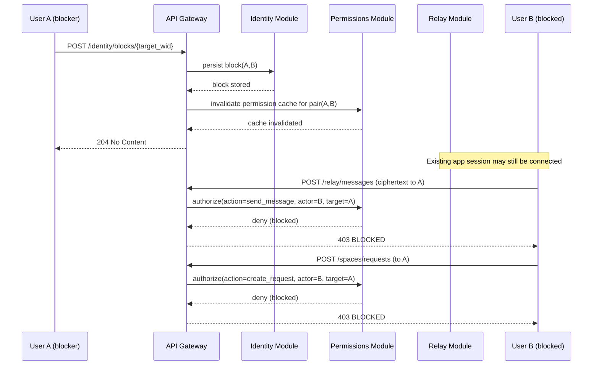

# Sequence: Block During Active Session

## Enforcement Decision
- Block is effective immediately for all new actions.
- Existing cryptographic sessions are not trusted for authorization.
- Authorization is server-side per action; active connection does not bypass block.
- Phase 1 behavior: messaging is stopped immediately; spaces are not auto-deleted.
