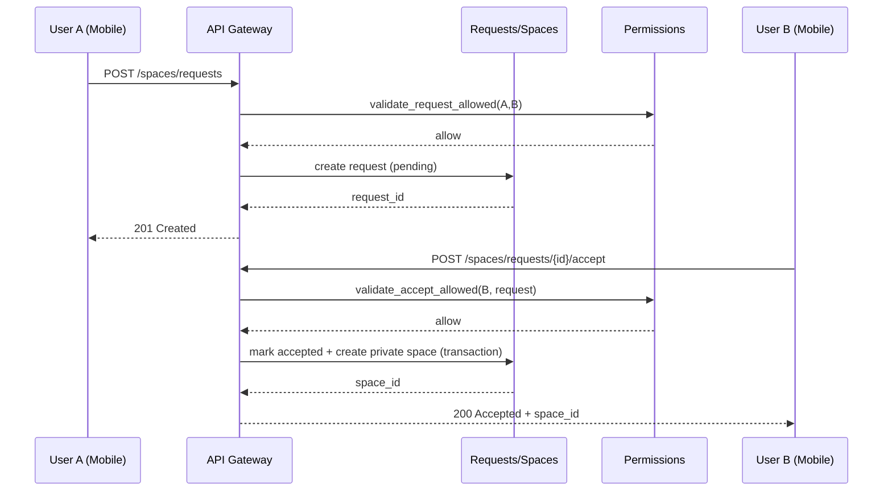
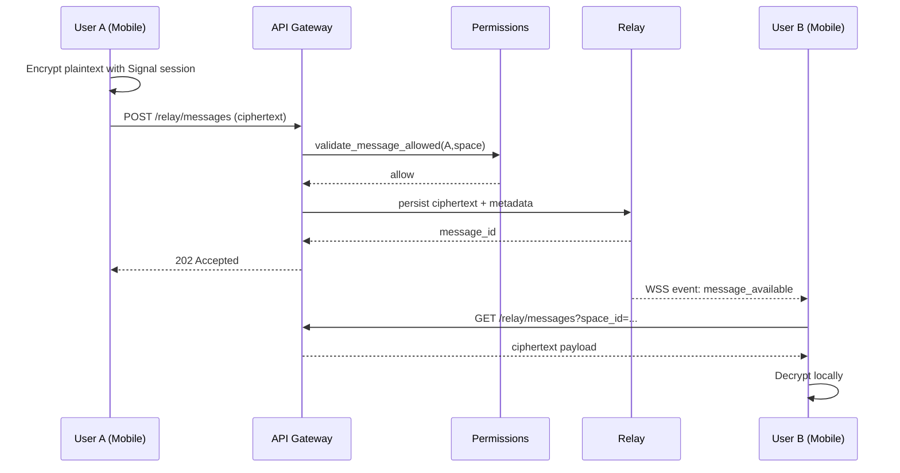
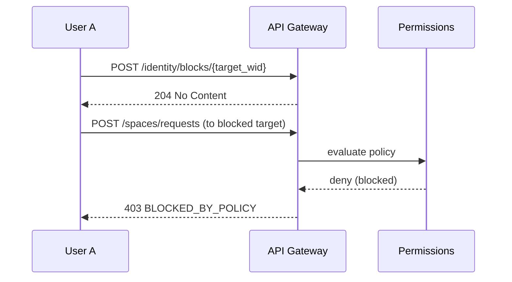

# WHISP Sequencing Core Flows (Phase 1)

## 1. Contact Request to Private Space

```mermaid
sequenceDiagram
    participant A as User A (Mobile)
    participant API as API Gateway
    participant R as Requests/Spaces
    participant P as Permissions
    participant B as User B (Mobile)

    A->>API: POST /spaces/requests
    API->>P: validate_request_allowed(A,B)
    P-->>API: allow
    API->>R: create request (pending)
    R-->>API: request_id
    API-->>A: 201 Created

    B->>API: POST /spaces/requests/{id}/accept
    API->>P: validate_accept_allowed(B, request)
    P-->>API: allow
    API->>R: mark accepted + create private space (transaction)
    R-->>API: space_id
    API-->>B: 200 Accepted + space_id
```

## 2. Encrypted Message Delivery

```mermaid
sequenceDiagram
    participant A as User A (Mobile)
    participant API as API Gateway
    participant P as Permissions
    participant R as Relay
    participant B as User B (Mobile)

    A->>A: Encrypt plaintext with Signal session
    A->>API: POST /relay/messages (ciphertext)
    API->>P: validate_message_allowed(A,space)
    P-->>API: allow
    API->>R: persist ciphertext + metadata
    R-->>API: message_id
    API-->>A: 202 Accepted
    R-->>B: WSS event: message_available
    B->>API: GET /relay/messages?space_id=...
    API-->>B: ciphertext payload
    B->>B: Decrypt locally
```

## 3. Global Block Enforcement

```mermaid
sequenceDiagram
    participant A as User A
    participant API as API Gateway
    participant P as Permissions

    A->>API: POST /identity/blocks/{target_wid}
    API-->>A: 204 No Content
    A->>API: POST /spaces/requests (to blocked target)
    API->>P: evaluate policy
    P-->>API: deny (blocked)
    API-->>A: 403 BLOCKED_BY_POLICY
```
