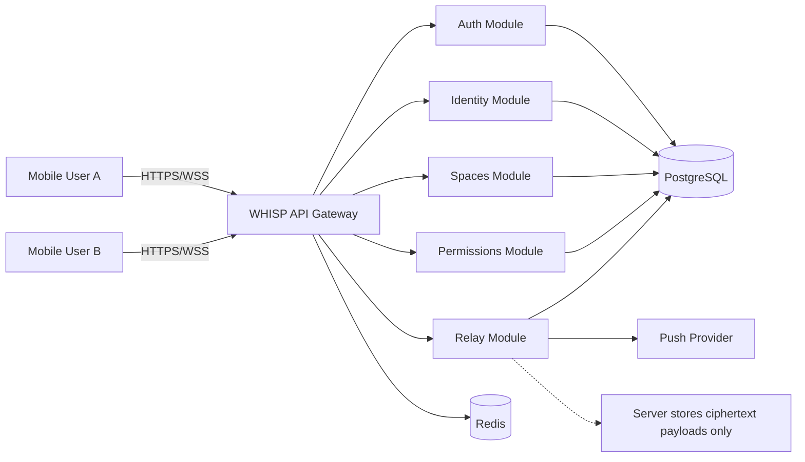

# WHISP System Context Diagram (Phase 1)

## Boundaries
- Client performs key generation, session establishment, encrypt/decrypt.
- Server validates auth, permissions, routing, membership, and stores encrypted blobs.
- Global block applies at `wid` level across all communication paths.
