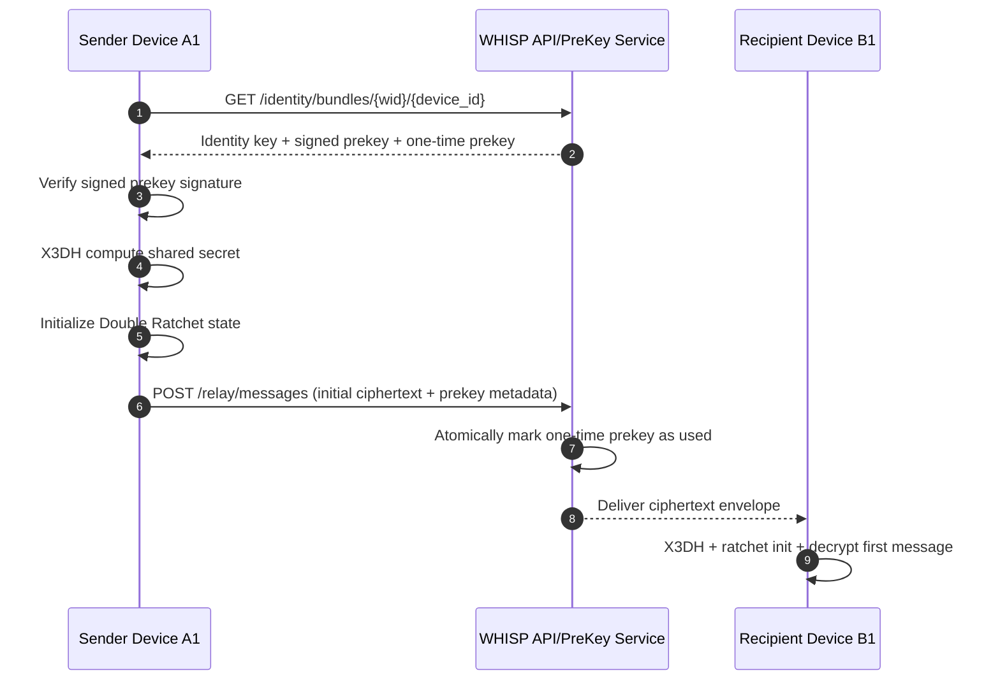
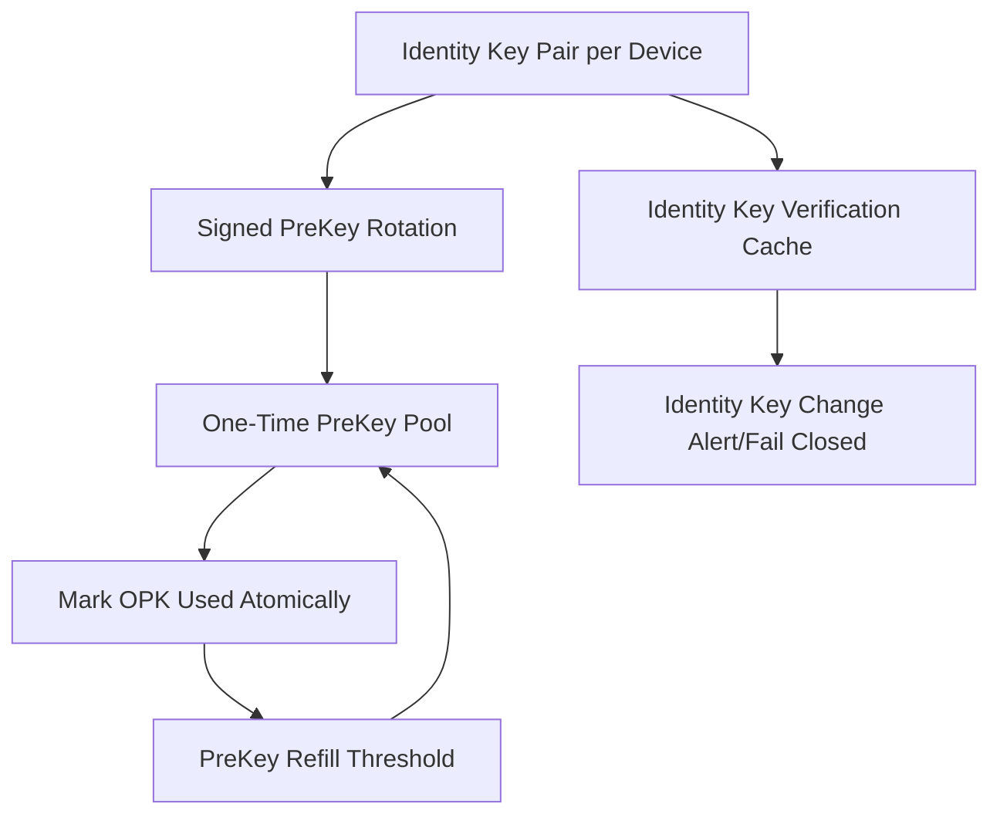
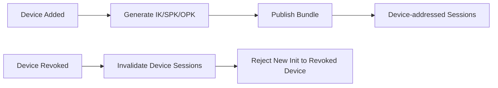

# F3 Threat Model (1:1 PreKey / Double Ratchet)

Version: `v2-f3-1to1-prekey`
Phase: `F3`
Scope: 1:1 Signal session setup and ratchet messaging
Date: `2026-03-04`

## Trust Boundaries
- Boundary A: Device local secure storage and ratchet state.
- Boundary B: API gateway and backend prekey/relay services.
- Boundary C: Network transport between devices and server.

Server is untrusted for plaintext confidentiality and session secrecy.

## Session Establishment Flow

## Key Lifecycle

## Device Lifecycle Interaction

## Attack Surface Table
| ID | Threat | Vector | Impact | Mitigation | Evidence |
|---|---|---|---|---|---|
| T1 | PreKey Depletion Attack | Exhaust OPK pool via repeated inits | Session bootstrap denial | Rate limit + low-watermark alert + refill job + per-device quota | Prekey depletion regression + metrics |
| T2 | PreKey Replay Attack | Reuse consumed OPK | Session replay / confusion | Atomic OPK consume; replay -> deterministic reject | DB transaction test + replay e2e |
| T3 | Fake Bundle Injection | Malicious bundle response | MITM setup | Signed prekey verification + pinned identity key checks | Signature verification tests |
| T4 | MITM via Bundle Manipulation | Tamper in transit/proxy | Confidentiality break | TLS + bundle signature verify + identity fingerprint checks | tamper/integrity tests |
| T5 | Cross-Device Key Confusion | Wrong device bundle/session mapping | Message decrypt failure / leakage | `(wid, device_id)` strict addressing + per-device state isolation | multi-device routing tests |
| T6 | Session Desync | Out-of-order or missing ratchet steps | Message loss/DoS | deterministic error handling + retry envelope semantics | desync regression tests |
| T7 | State Rollback Attack | Revert local ratchet state | Break PCS/FS assumptions | monotonic ratchet counters + secure-storage anti-rollback marker | rollback tests |
| T8 | Identity Key Change Attack | Silent IK replacement | MITM risk | fail-closed on IK mismatch + explicit trust reset flow | identity change tests |
| T9 | Downgrade Attack (Echo->Signal) | Force fallback to echo mode | weaker guarantees | protocol mode pinning; session endpoints reject echo fallback | downgrade regression tests |

## Security Goals for F3
- Correct asymmetric session bootstrap (X3DH).
- Forward secrecy for 1:1 ratchet sessions.
- Post-compromise security via ratchet step advancement.
- One-time prekey non-reuse.
- Deterministic multi-device isolation.
- Replay protection on session-init artifacts.

## Non-Goals in F3
- Group secrecy guarantees.
- MLS compliance.
- Media crypto and attachment key distribution.

## Required Security Regressions
- Prekey replay rejection test.
- Signed prekey signature verification failure test.
- Identity key change fail-closed test.
- Cross-device confusion negative test.
- Downgrade-to-echo rejection test.
- State rollback detection test.
- Message-key reuse rejection test.

## Day 5 Hardening Notes
- Ratchet rollback detection uses a monotonic per-session marker persisted outside serialized session state.
- Message-counter replay (duplicate counter) is fail-closed and rejected as desync.
- PreKey depletion remains deterministic (`409`) and does not trigger fallback/reuse.

## Residual Risks (Accepted for F3)
- Operational prekey refill lag can temporarily reduce session availability.
- Device compromise remains endpoint risk until revocation propagates.
