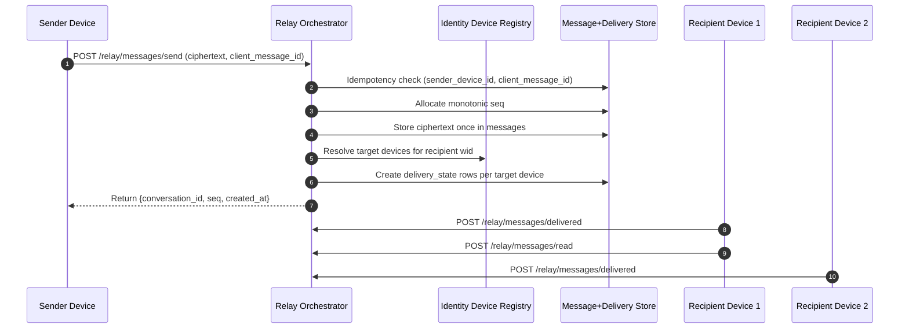

# F4 Threat Model (Messaging Orchestrator)

Version: `v2-f4-day3-baseline`  
Phase: `F4`  
Date: `2026-03-11`  
Scope: Messaging orchestration above the F3 Signal core.

## Scope Status
### Implemented in F4
- Day 1: deterministic conversations + server monotonic `seq`
- Day 2: ciphertext message storage with retry-safe idempotency
- Day 3: device-scoped `delivery_state`

### Not Yet Implemented
- Day 4: `fanout_queue` orchestration
- Day 5: deterministic resync/sync endpoints

## Trust Boundaries
- Boundary A: Mobile Signal engine  
  Trusted for encryption/decryption only.
- Boundary B: Relay/orchestrator backend  
  Untrusted for plaintext confidentiality and session secrecy.
- Boundary C: Persistent metadata storage  
  Trusted only for durability, not secrecy.
- Boundary D: Network transport  
  Untrusted beyond TLS integrity/confidentiality assumptions.

## Current Architecture Flow

## Security Goals
- Preserve crypto blindness on the server.
- Keep message ordering deterministic.
- Make retries idempotent and side-effect stable.
- Track delivery/read state per device, not per wid.
- Prevent forged or cross-device state mutation.

## Assets
- `conversation_id`
- server-assigned `seq`
- ciphertext blobs
- `(sender_device_id, client_message_id)` idempotency keys
- `delivery_state` rows per target device
- target device registry from identity service

## Attack Surface Table
| ID | Threat | Vector | Impact | Mitigation | Evidence |
|---|---|---|---|---|---|
| M1 | Ordering corruption | Race / client-provided ordering | Divergent device history | Server-only `seq`; unique `(conversation_id, seq)`; concurrency tests | F4 Day 1 unit + e2e |
| M2 | Duplicate send replay | Retry with same logical send | Double-insert, duplicate user-visible messages | Unique `(sender_device_id, client_message_id)`; idempotent replay return | F4 Day 2 tests |
| M3 | Cross-conversation idempotency abuse | Same idempotency key with different conversation/payload | Message confusion | Deterministic `409 Conflict` | F4 Day 2 tests |
| M4 | Plaintext/server-crypto boundary violation | Server decrypts or inspects ciphertext | Confidentiality loss | Ciphertext opaque blob only; no crypto operations in relay | Relay module review + tests |
| M5 | Device-state confusion | Delivery/read tracked per wid | False sync/read state across devices | `delivery_state` keyed by `(conversation_id, seq, target_device_id)` | F4 Day 3 schema + tests |
| M6 | Read-before-delivered anomaly | API/storage allows `read_at` first | Invalid state transitions | Code check + DB `CHECK (read_at IS NULL OR delivered_at IS NOT NULL)` | F4 Day 3 migration + tests |
| M7 | Retry-duplicates delivery rows | Idempotent send re-creates target rows | Duplicate queue/state entries later | Retry returns existing message only; no re-creation of delivery rows | F4 Day 3 tests |
| M8 | Wrong-device state mutation | Device A marks device B delivered/read | False device sync | Strict target-device lookup by `(conversation_id, seq, target_device_id)` | F4 Day 3 tests |
| M9 | Metadata leak expansion | Storing extra plaintext-derived fields | Privacy erosion | Minimal metadata-only schema and API response surfaces | schema/openapi review |
| M10 | Queue/orchestration drift (next step) | Future fanout mutates delivery truth directly | Hidden state inconsistency | Separate `fanout_queue` from `delivery_state`; queue `delivered` must not imply message delivered | Day 4 hard constraint |

## Implemented Security Controls
- Server-authoritative ordering
- Idempotent retry semantics
- Canonical base64 validation and size limits
- Device-scoped delivery/read state
- DB-enforced delivered-before-read invariant
- No duplicate delivery-row creation on retry
- Relay coverage gate at `100/100`

## Day 3 Security Review Summary
- PASS: device-scoped delivery/read model
- PASS: delivered-before-read enforced in code and schema
- PASS: retry does not create duplicate delivery rows
- PASS: relay remains crypto-blind
- PASS: cross-device isolation covered by tests

## Day 4 Threat Additions (Frozen Requirements)
When fanout is added, the following threats become active and must be mitigated:

| ID | Threat | Mitigation Requirement |
|---|---|---|
| M11 | Duplicate fanout rows on retry | `fanout_queue` unique `(conversation_id, seq, target_device_id)` |
| M12 | Wrong-device pending fetch | `GET /relay/messages/pending` filtered by both `target_wid` and `target_device_id` |
| M13 | Queue truth confusion | `fanout_queue.delivered` must not set `delivery_state.delivered_at` |
| M14 | Orphan queue rows | FK `(conversation_id, seq) -> messages(conversation_id, seq) ON DELETE CASCADE` |
| M15 | Nondeterministic pending order | Pending fetch must return deterministic order and documented limit |

## Required Day 4 Regressions
- Send creates one queue row per target device.
- Retry send creates no additional queue rows.
- Device A pending fetch excludes device B messages.
- Empty queue returns empty list deterministically.
- Queue delivery marker does not mutate `delivery_state.delivered_at`.

## Residual Risks (Accepted Pre-Day-4)
- No offline pending fetch exists yet.
- No resync range recovery exists yet.
- No push/websocket transport orchestration exists yet.

## Non-Negotiable Boundary
- Server may store ciphertext.
- Server may store ordering and orchestration metadata.
- Server may not decrypt, derive keys, or inspect ratchet/session state.
